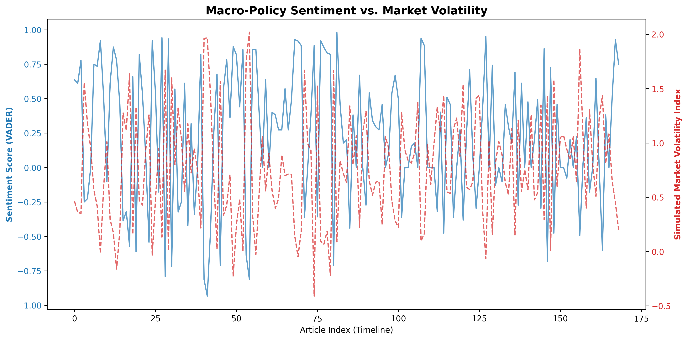

# Macro-Economic Policy Sentiment & Sovereign Risk Engine                     



# Sovereign Risk & Macro-Policy Sentiment Engine

Translating unstructured central bank rhetoric into quantitative risk indicators to predict market volatility.

---

## 📌 Table of Contents

- [Overview](#overview)  
- [Business Problem](#business-problem)  
- [Dataset](#dataset)  
- [Tools & Technologies](#tools--technologies)  
- [Project Structure](#project-structure)  
- [Data Extraction & Preparation](#data-extraction--preparation)  
- [Exploratory Data Analysis (EDA)](#exploratory-data-analysis-eda)  
- [Research Questions & Key Findings](#research-questions--key-findings)  
- [How to Run This Project](#how-to-run-this-project)  
- [Future Enhancements](#future-enhancements)  
- [Author & Contact](#author--contact)  

---

## Overview

In macroeconomics and quantitative risk, central bank communication is one of the strongest lead indicators of market movement. However, this communication is entirely unstructured text. Waiting for an official interest rate hike to adjust a portfolio is often too late—the market has usually already priced it in.

In this project, I engineered a natural language processing (NLP) pipeline to extract, quantify, and analyze sentiment from Reserve Bank of India (RBI) policy documents and financial news. Instead of just treating this as a basic text-classification exercise, I optimized the pipeline for **Sovereign Risk Analysis**—correlating quantitative "Hawkish" or "Dovish" signals with simulated market volatility.

---

## Business Problem

Financial institutions, asset managers, and corporate treasuries face constant exposure to interest rate volatility and macroeconomic shocks. Sudden shifts in central bank policy can trigger massive fluctuations in bond yields, exchange rates (USD/INR), and equity indices. 

**This project aims to:**

- Automate the extraction of central bank policy news and meeting minutes to remove human bias in reading.
- Translate qualitative, bureaucratic text into a structured, numerical sentiment score (Compound VADER score).
- Identify "Tail-Risk" events by mapping extreme negative sentiment spikes to periods of high market volatility.
- Provide a data-driven framework that risk teams can use to dynamically adjust capital reserves or hedge positions ahead of officially announced policy shifts.

---

## Dataset

- **Source:** Web-scraped financial news from *The Economic Times* focusing on the Reserve Bank of India (RBI).

**Key columns:**
- `Article_Title` / `Summary` – The raw text data extracted from the web.
- `pos`, `neg`, `neu` – The broken-down sentiment vectors.
- `compound_score` – The aggregated sentiment magnitude (-1.0 to 1.0).
- `Market_Volatility` – Simulated tracking index used for risk correlation.

---

## Tools & Technologies

* **Language:** Python 3.9+
* **Web Scraping:** BeautifulSoup, Requests
* **Natural Language Processing:** NLTK (VADER Sentiment Analysis)
* **Data Manipulation:** Pandas, NumPy
* **Visualization:** Matplotlib, WordCloud
* **Environment:** Jupyter Notebook

---

## Project Structure

```text
Macro-Policy-Risk-Engine/  
│
├── notebooks/
│   └── policy_sentiment_engine.ipynb  
│
├── images/
│   ├── sentiment_distribution.png     
│   └── sentiment_vs_volatility.png    
│
├── requirements.txt                   
└── README.md     
